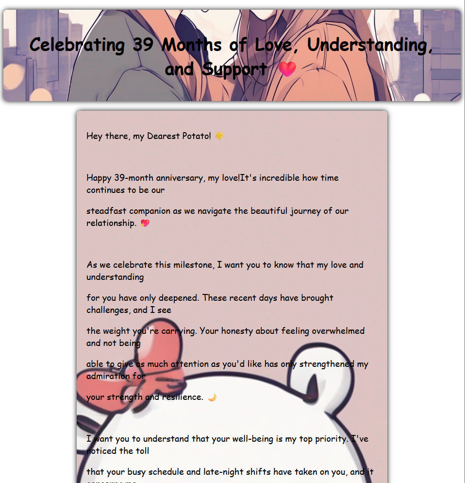
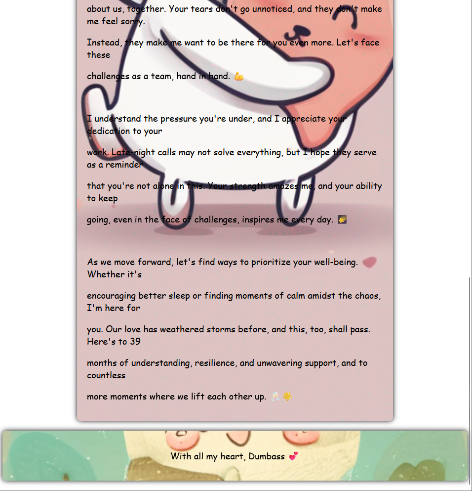

<!-- PROJECT LOGO -->

  

<h3 align="center"><b>| Cute-Love | Website |</b></h3>

  

    For an Illusionary brand, Cute-Love™
     
     
    <a href="https://sahiledu.github.io/Love-Website/">View Demo</a>
    ·
    <a href="https://github.com/Sahiledu/Love-Website/issues">Report Bug</a>
    ·
    <a href="https://github.com/Sahiledu/Love-Website">Request Feature</a>
  

 

<!-- ABOUT THE PROJECT -->
## Preview

 
 

> **Note**  
>> Application is still under Development

 

## Built With

-    
-    
- 

 

## Tools Used

-    
-   
-   
- 

 

## Features

- Built with **modern Javascript** practices
- It can **evaluate the form** effectively with basic conditions
- Comes with **optimized UI** & **UX**
- **Responsive** for both **Desktop** & **Mobile**

 

## Outcome

* Used HTML5 **semantic elements** for better readability and structure
* Used CSS3 **grid** and **flex** to manage layouts
* Used **Git** and **GitHub** for project management
* Tried to maintain **clean code**
* **Cross tested** on Firefox and Chromium based browsers

 

## What I learned

* Got some experience in Form handling with **Javascript**
* Learned to use **ternery** operator effectively to minimize the code
* A lot of minor things

 

<!-- ACKNOWLEDGMENTS -->
## Acknowledgments

* Inspiration by [The Odin Project](https://www.theodinproject.com/)

 

<!-- LICENSE -->
## License

- Distributed under the MIT License. See `LICENSE` for more information.

 

<!-- CONTACT -->
## Author

- Created By: Sahil Nain

